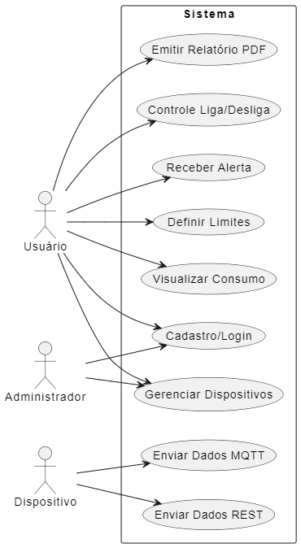
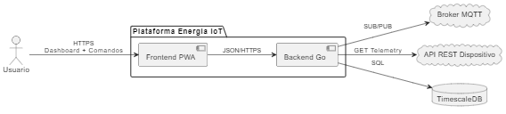
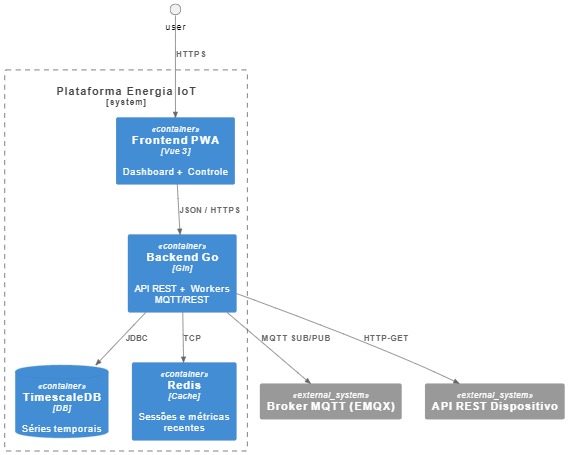
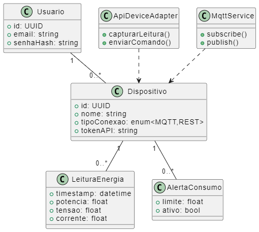
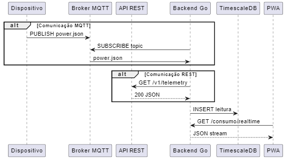

# Universidade Católica de Brasília
## Curso de Engenharia de Software
### Portfólio Acadêmico I — 2025/2

**Request for Comments (RFC)**  
**Plataforma de Controle de Consumo de Energia Elétrica Residencial com IoT**

**Autor:** Pedro Henrique Dias da Costa  
**Professor Orientador:** Prof. __________________  
**Versão:** 1.4 (Diagramas Atualizados)  
**Data:** 08/07/2025  

---

# RFC – Plataforma de Controle de Consumo de Energia Elétrica Residencial com IoT

---

## Índice
- [Resumo](#resumo)
- [1. Introdução](#1-introdução)
- [2. Descrição do Projeto](#2-descrição-do-projeto)
- [3. Especificação Técnica](#3-especificação-técnica)
- [4. Próximos Passos (Cronograma)](#4-próximos-passos-cronograma)
- [5. Referências](#5-referências)
- [6. Apêndices](#6-apêndices)
- [7. Avaliações de Professores](#7-avaliações-de-professores)

---

## Resumo
Esta proposta descreve o desenvolvimento de uma plataforma composta por dispositivos IoT e software em nuvem para **monitorar, analisar e otimizar** o consumo de energia elétrica em residências brasileiras. O sistema oferecerá dois modos de comunicação com as tomadas inteligentes — via **broker MQTT** *e* via **API REST proprietária** — fornecendo telemetria em tempo real, dashboards interativos, recomendações de economia e automação de cargas, com a meta de **reduzir em pelo menos 10 %** a conta de luz dos usuários após quatro meses de uso.

---

## 1. Introdução
### 1.1 Contexto
O custo da energia elétrica no Brasil aumentou 18 % entre 2022 e 2024 (ANEEL, 2024). Paralelamente, dispositivos conectados tornaram-se mais acessíveis, permitindo medições granulares (corrente, tensão e potência) que antes eram restritas a ambientes industriais.

### 1.2 Justificativa
- **Relevância econômica:** Contas de luz representam ~23 % do orçamento doméstico de famílias de classe média.  
- **Sustentabilidade:** Cada 10 % de redução no consumo residencial evita ~130 kg de CO₂/ano por domicílio.  
- **Viabilidade:** Sensores Wi-Fi de mercado custam menos de **R\$ 120**, usando protocolos abertos (MQTT) ou APIs REST expostas pelo fabricante.

### 1.3 Objetivo Geral
Desenvolver uma plataforma integrada (hardware + software) que monitore, analise e otimize o uso de energia residencial, empoderando o usuário na tomada de decisões e no controle remoto de aparelhos.

### 1.4 Objetivos Específicos
1. **Coletar** leituras de potência, tensão e corrente a cada segundo via tomadas inteligentes (MQTT ou API REST).  
2. **Armazenar** as séries temporais em banco especializado (TimescaleDB).  
3. **Visualizar** o consumo em dashboards web com granularidade diária, semanal e mensal.  
4. **Recomendar** ações de economia com base em limites e médias históricas.  
5. **Automatizar** o desligamento de cargas conforme configuração do usuário.  
6. **Escalar** o sistema para **≥ 50** dispositivos por residência sem degradação perceptível.

---

## 2. Descrição do Projeto
### 2.1 Problema a Ser Resolvido
Usuários residenciais carecem de ferramentas unificadas que combinem **medição precisa**, **visualização compreensível** e **controles automatizados** para reduzir gastos e impactos ambientais.

### 2.2 Público-alvo
- **Primário:** Proprietários e inquilinos (25 – 55 anos) conectados à internet.  
- **Secundário:** Concessionárias de energia, instaladores elétricos, pesquisadores.

### 2.3 Escopo e Limitações
| **Incluído**                                     | **Excluído**                      |
| ------------------------------------------------ | --------------------------------- |
| Monitoramento monofásico (< 60 s)                | Medição trifásica industrial      |
| Integração **MQTT** e **API REST** do fabricante | Apps móveis nativos               |
| Dashboards web (PWA)                             | Integração com assistentes de voz |
| Alertas por e-mail / push                        | Algoritmos de IA avançada         |
| Controle remoto de tomadas                       | —                                 |

### 2.4 MVP Funcional (4 meses)
- Cadastro e autenticação JWT.  
- Registro de até **10** dispositivos por usuário.  
- Dashboard em Vue 3 com consumo em tempo real.  
- Alertas de pico configuráveis (+ e-mail).  
- Controle **Liga/Desliga** via MQTT *ou* via API REST (quando suportado).

---

## 3. Especificação Técnica
### 3.1 Requisitos e Casos de Uso
#### 3.1.1 Funcionais
| ID   | Descrição                                      | Prioridade |
| ---- | ---------------------------------------------- | ---------- |
| RF01 | Cadastro / login de usuários (Admin, Usuário)  | Alta       |
| RF02 | CRUD de dispositivos IoT                       | Alta       |
| RF03 | Receber telemetria **MQTT** e persistir        | Alta       |
| RF04 | Consumir dados via **API REST** do dispositivo | Média      |
| RF05 | Exibir consumo em tempo real (< 60 s)          | Alta       |
| RF06 | Visualizar histórico por período               | Alta       |
| RF07 | Definir limites e enviar alertas               | Média      |
| RF08 | Projeções heurísticas (médias móveis)          | Média      |
| RF09 | Relatórios mensais em PDF                      | Baixa      |
| RF10 | Controle remoto de tomadas (MQTT ou API REST)  | Média      |

#### 3.1.2 Não Funcionais
| ID    | Descrição                             | Meta   |
| ----- | ------------------------------------- | ------ |
| RNF01 | Latência API p95 < 2000 ms            | 2 s    |
| RNF02 | Suporte a 50 dispositivos simultâneos | OK     |
| RNF03 | Disponibilidade mensal ≥ 99,5 %       | 99,5 % |
| RNF04 | Criptografia TLS em trânsito          | 100 %  |
| RNF05 | Cobertura de testes unitários ≥ 80 %  | 80 %   |
| RNF06 | Acessibilidade WCAG 2.1 AA            | AA     |

#### 3.1.3 Diagrama de Casos de Uso
*Representa todas as interações externas com o sistema; cobre RF01–RF10.*  

### 3.2 Considerações de Design / Arquitetura

                  ┌────────────────┐
[Tomada IoT]──MQTT──▶│ MQTT Broker │──▶ Backend Go ──▶ TimescaleDB
│ └────────────────┘
│ REST API

- **Fluxo duplo:** cada dispositivo expõe dados via MQTT *ou* REST; o Backend Go trata ambos.  

#### 3.2.1 Diagrama de Contexto  
*Mostra atores e sistemas externos.*  

#### 3.2.2 Diagrama de Contêiner  
*Detalha os componentes internos e dependências.*  

### 3.3 Stack Tecnológica
| Camada        | Tecnologia                                      |
| ------------- | ----------------------------------------------- |
| Dispositivo   | ESP32 + Sensor SCT-013                          |
| Mensageria    | EMQX 5 (MQTT v3.1.1)                            |
| API Device    | REST/JSON + OAuth2 (quando exigido)             |
| Backend       | Go 1.22 (Gin) + HTTP Client padrão              |
| Base de dados | PostgreSQL 15 / TimescaleDB 2.15                |
| Frontend      | Vue 3 + Vite (PWA)                              |
| Infra         | Docker Compose (dev) / Kubernetes + Helm (prod) |

### 3.4 Segurança
- Comunicação: TLS mútuo (MQTT e HTTPS).  
- Dados em repouso: criptografia AES-256 nos volumes.  
- Autenticação: JWT + OAuth2; senhas via bcrypt.  
- Autorização: RBAC por escopo de dispositivo.  
- Compliance: LGPD (limitação de coleta, consentimento expresso).

---

## 4. Próximos Passos (Cronograma)
| Sprint (2 semanas) | Entregas-chave                                                                |
| ------------------ | ----------------------------------------------------------------------------- |
| 1                  | Repo, CI/CD, esqueleto Vue, broker MQTT local, POC chamada REST               |
| 2                  | CRUD usuários/dispositivos, telemetria mock (MQTT + REST)                     |
| 3                  | Persistência TimescaleDB, dashboard realtime                                  |
| 4                  | Alertas + limites, controle remoto (MQTT + REST)                              |
| 5                  | Projeções heurísticas, relatórios PDF                                         |
| 6                  | Hardening segurança, testes de carga, documentação final                      |

---

## 5. Referências
- ANEEL (2024). **Relatório de Consumo Residencial**.  
- Gartner (2025). *Market Guide for Home Energy Management*.  
- Documentações: Vue 3, EMQX 5, TimescaleDB 2.15.  
- TP-Link (2025). **Kasa Smart Plug Local API** — GitHub `whitslack/kasa`, v0.6.  
- Allterco Robotics (2025). **Shelly HTTP API v2** — *Shelly Cloud Docs*.  
- Tuya Inc. (2024). **Smart Home Cloud Service API Reference** — Tuya Developer Portal, rev. 2024-06-26.  
- Tasmota Community (2025). **Tasmota REST API & Commands** — *Tasmota Docs* v14.6.0.  

---

## 6. Apêndices
### 6.1 Diagramas Complementares
#### Diagrama de Classes  
*Entidades de domínio e serviços de integração.*  

#### Diagrama de Sequência (Fluxo MQTT/REST)  
*Fluxo de ingestão, persistência e entrega em tempo real.*  

### 6.2 Riscos e Mitigações
| Risco                  | Impacto           | Prob. | Estratégia                                 |
| ---------------------- | ----------------- | ----- | ------------------------------------------ |
| Escopo além do MVP     | Atraso            | M     | **Feature freeze** na Sprint 4             |
| Falha de hardware IoT  | Dados incompletos | M     | Batch upload; health-check de dispositivos |
| Latência de rede alta  | UX ruim           | B     | Cache local + reconexão WebSocket          |
| Falta de domínio em Go | Código frágil     | M     | Pair programming, TDD, revisões de código  |

---

## 7. Avaliações de Professores
> *Espaço reservado para comentários, carimbos e assinaturas.*
